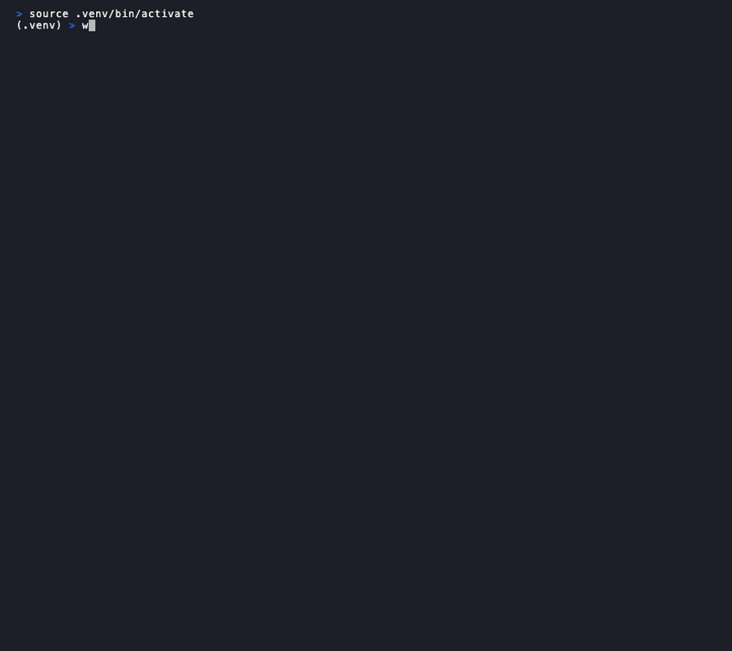

# WriteScore

[](https://github.com/BOHICA-LABS/writescore/actions/workflows/ci.yml)
[](https://www.python.org/downloads/)
[](https://opensource.org/licenses/MIT)
[](https://github.com/BOHICA-LABS/writescore/releases)
[](docs/)

> **Identify AI patterns in your writing and get actionable feedback to sound more human.**



## Quick Start

```bash
pip install -e .
writescore analyze README.md
```

That's it! You'll see a detailed analysis with scores and improvement suggestions.

## Installation

```bash
# Basic installation
pip install -e .

# With development dependencies
pip install -e ".[dev]"

# Download required NLP model
python -m spacy download en_core_web_sm
```

## Why WriteScore?

**The Problem**: AI detection tools give binary "AI/human" verdicts without explaining why or how to improve.

**The Solution**: WriteScore analyzes 12+ writing dimensions to identify specific patterns that make text sound AI-generated, then provides actionable recommendations.

**Key Differentiators**:
- **Actionable feedback** — Know exactly what to fix, not just "this seems AI-generated"
- **Multi-dimensional analysis** — Examines vocabulary, sentence variety, formatting patterns, and more
- **Quality-focused** — Treats writing improvement as the goal, not accusation
- **Transparent scoring** — See how each dimension contributes to your score

**When to use WriteScore**:
- Polishing AI-assisted drafts to sound more natural
- Identifying mechanical patterns in your own writing
- Quality checks before publishing

**When NOT to use**:
- Academic integrity enforcement (use dedicated tools)
- Legal proof of authorship
- Detection of latest-generation models with high confidence

## Features

- **Dual Scoring** — Detection risk + quality score in one analysis
- **12 Analysis Dimensions** — From vocabulary patterns to syntactic complexity
- **Multiple Modes** — Fast checks to comprehensive analysis
- **Actionable Insights** — Specific recommendations ranked by impact
- **Batch Processing** — Analyze entire directories
- **Score History** — Track improvements over time

## Usage

```bash
# Basic analysis
writescore analyze document.md

# Detailed findings with recommendations
writescore analyze document.md --detailed

# Show dual scores (detection risk + quality)
writescore analyze document.md --show-scores

# Fast mode for quick checks
writescore analyze document.md --mode fast

# Full analysis for final review
writescore analyze document.md --mode full

# Batch process a directory
writescore analyze --batch docs/
```

## Analysis Modes

| Mode | Speed | Best For |
|------|-------|----------|
| **fast** | Fastest | Quick checks, CI/CD |
| **adaptive** | Balanced | Default, most documents |
| **sampling** | Medium | Large documents |
| **full** | Slowest | Final review, maximum accuracy |

See the [Analysis Modes Guide](docs/analysis-modes-guide.md) for details.

## Documentation

| Document | Description |
|----------|-------------|
| [Architecture](docs/architecture.md) | System design, components, patterns |
| [Analysis Modes Guide](docs/analysis-modes-guide.md) | Mode comparison and usage |
| [Development History](docs/DEVELOPMENT-HISTORY.md) | Project evolution and roadmap |
| [Migration Guide](MIGRATION-v6.0.0.md) | Upgrading from AI Pattern Analyzer |
| [Changelog](CHANGELOG.md) | Version history |

## Contributing

We welcome contributions! See [CONTRIBUTING.md](CONTRIBUTING.md) for guidelines.

## License

MIT License - see [LICENSE](LICENSE) for details.
