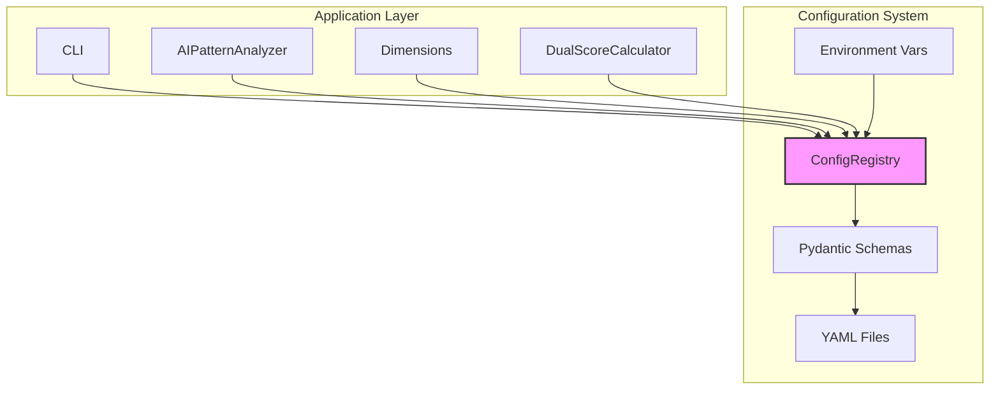

# 18. Configuration System

## 18.1 Overview

WriteScore uses a **Configuration over Code** pattern where behavioral parameters are externalized to declarative YAML files rather than embedded in application logic. This approach provides:

- **Flexibility**: Tune behavior without code changes
- **Transparency**: Non-developers can review and adjust settings
- **Maintainability**: Single source of truth for configurable values
- **Testability**: Easy to test with different configurations

## 18.2 Architecture

```
┌─────────────────────────────────────────────────────────────────┐
│                       Application Code                          │
│              (Analyzer, Dimensions, Scoring, CLI)               │
├─────────────────────────────────────────────────────────────────┤
│                      ConfigRegistry                             │
│           (Singleton - Central Configuration Access)            │
├─────────────────────────────────────────────────────────────────┤
│                     Pydantic Schemas                            │
│     (Type Validation & Defaults - config/schemas/*.py)          │
├──────────────────┬──────────────────┬───────────────────────────┤
│   base.yaml      │  environment.yaml │    Environment Vars      │
│   (defaults)     │  (overrides)      │    (runtime override)    │
└──────────────────┴──────────────────┴───────────────────────────┘
```

## 18.3 Core Components

### ConfigRegistry (`config/registry.py`)

Thread-safe singleton providing centralized configuration access:

```python
class ConfigRegistry:
    """Centralized configuration access point."""

    @classmethod
    def initialize(cls, env: str = "default", config_dir: Path = None) -> None:
        """Load configuration from YAML files."""
        pass

    @classmethod
    def get(cls, schema: Type[T]) -> T:
        """Get typed configuration section."""
        pass

    @classmethod
    def reset(cls) -> None:
        """Clear configuration (primarily for testing)."""
        pass

    @classmethod
    def is_initialized(cls) -> bool:
        """Check if registry has been initialized."""
        pass
```

### Pydantic Schemas (`config/schemas/`)

Type-safe configuration models with validation and defaults:

| Schema | File | Purpose |
|--------|------|---------|
| **DimensionConfig** | `dimensions.py` | Dimension profiles, weights, parameters |
| **ScoringConfig** | `scoring.py` | Score thresholds, categories, calibration |
| **ContentTypesConfig** | `content_types.py` | Content type definitions, weights, thresholds |
| **AnalysisConfig** | `analysis.py` | Analysis modes, sampling, timeouts |

### Configuration Files (`config/`)

```
config/
├── base.yaml           # Default configuration (checked into git)
├── development.yaml    # Development overrides
├── production.yaml     # Production overrides
├── test.yaml           # Test environment config
└── schemas/
    ├── __init__.py
    ├── dimensions.py
    ├── scoring.py
    ├── content_types.py
    └── analysis.py
```

## 18.4 Configuration Loading

### Load Order (Layered Override)

1. **Base Configuration** (`base.yaml`) - Default values, always loaded
2. **Environment Configuration** (`{env}.yaml`) - Environment-specific overrides
3. **Environment Variables** - Runtime overrides via `WRITESCORE_*` prefix

```python
# Example: Loading configuration
from writescore.config.registry import ConfigRegistry
from writescore.config.schemas.scoring import ScoringConfig

# Initialize at application startup
ConfigRegistry.initialize(env="production")

# Access typed configuration
scoring_config = ConfigRegistry.get(ScoringConfig)
threshold = scoring_config.human.min_threshold  # Type-safe access
```

### Environment Variable Override

```bash
# Override specific values at runtime
export WRITESCORE_SCORING__HUMAN__MIN_THRESHOLD=85
export WRITESCORE_DIMENSIONS__DEFAULT_PROFILE=fast
```

## 18.5 Configuration Schema Examples

### Dimension Profiles

```yaml
# config/base.yaml
dimensions:
  default_profile: balanced

  profiles:
    fast:
      - perplexity
      - burstiness
      - structure
      - formatting

    balanced:
      - perplexity
      - burstiness
      - structure
      - formatting
      - voice
      - lexical
      - readability
      - sentiment

    full:
      - perplexity
      - burstiness
      - structure
      - formatting
      - voice
      - lexical
      - readability
      - sentiment
      - syntactic
      - predictability
      - advanced_lexical
      - transition_marker
      - pragmatic_markers
      - figurative_language
      - semantic_coherence
      - ai_vocabulary
      - energy
```

### Scoring Thresholds

```yaml
scoring:
  categories:
    human:
      min_threshold: 75
      label: "Human-Written"
      color: "green"
    mixed:
      min_threshold: 45
      max_threshold: 74
      label: "Mixed/Edited"
      color: "yellow"
    ai:
      max_threshold: 44
      label: "AI-Generated"
      color: "red"

  confidence:
    high: 85
    medium: 70
    low: 50
```

### Content-Type Configuration

```yaml
content_types:
  types:
    - academic
    - professional_bio
    - blog
    - technical_book
    - marketing
    - news
    - social_media
    - creative_fiction

  weights:
    technical_book:
      readability: 0.15
      burstiness: 0.12
      structure: 0.12
      voice: 0.08
      lexical: 0.10
      semantic_coherence: 0.12
      predictability: 0.15
      formatting: 0.06
      transition_marker: 0.05
      pragmatic_markers: 0.05

    blog:
      readability: 0.10
      burstiness: 0.15
      voice: 0.18
      sentiment: 0.12
      lexical: 0.08
      figurative_language: 0.10
      energy: 0.12
      formatting: 0.08
      structure: 0.07

  thresholds:
    academic:
      readability:
        flesch_reading_ease:
          excellent: [30, 50]
          good: [20, 60]
          poor: [0, 20]
```

## 18.6 Integration Patterns

### Dependency Injection

Components receive configuration rather than fetching it:

```python
class DualScoreCalculator:
    def __init__(self, config: ScoringConfig = None):
        """Initialize with optional config injection."""
        if config is None:
            config = ConfigRegistry.get(ScoringConfig)
        self._config = config

    def calculate(self, results: Dict) -> DualScore:
        threshold = self._config.categories.human.min_threshold
        # Use threshold...
```

### Backward Compatibility

Fallback to hardcoded defaults when ConfigRegistry is not initialized:

```python
def get_dimension_weights(content_type: str) -> Dict[str, float]:
    """Get weights with fallback to defaults."""
    try:
        config = ConfigRegistry.get(ContentTypesConfig)
        return config.weights.get(content_type, DEFAULT_WEIGHTS)
    except RuntimeError:
        # ConfigRegistry not initialized - use hardcoded fallback
        logger.debug("ConfigRegistry not initialized, using default weights")
        return DEFAULT_WEIGHTS
```

### Testing Support

```python
import pytest
from writescore.config.registry import ConfigRegistry

@pytest.fixture(autouse=True)
def reset_config():
    """Reset configuration between tests."""
    yield
    ConfigRegistry.reset()

def test_with_custom_config(tmp_path):
    """Test with custom configuration."""
    config_file = tmp_path / "test.yaml"
    config_file.write_text("""
    scoring:
      categories:
        human:
          min_threshold: 90
    """)

    ConfigRegistry.initialize(config_dir=tmp_path, env="test")
    config = ConfigRegistry.get(ScoringConfig)
    assert config.categories.human.min_threshold == 90
```

## 18.7 Design Principles

### 1. Single Source of Truth

All configurable values live in YAML files, not scattered through code:

```python
# WRONG - Magic number in code
if score >= 75:
    return "human"

# RIGHT - Value from configuration
threshold = ConfigRegistry.get(ScoringConfig).categories.human.min_threshold
if score >= threshold:
    return "human"
```

### 2. Fail-Fast Validation

Pydantic schemas validate configuration at load time:

```python
class ScoringCategoryConfig(BaseModel):
    min_threshold: int = Field(ge=0, le=100)
    max_threshold: int = Field(ge=0, le=100)
    label: str
    color: str

    @validator('max_threshold')
    def validate_threshold_range(cls, v, values):
        if 'min_threshold' in values and v < values['min_threshold']:
            raise ValueError('max_threshold must be >= min_threshold')
        return v
```

### 3. Environment Isolation

Different configurations for different environments without code changes:

```bash
# Development
WRITESCORE_ENV=development uv run writescore analyze doc.md

# Production
WRITESCORE_ENV=production uv run writescore analyze doc.md

# Testing
WRITESCORE_ENV=test uv run pytest
```

### 4. Graceful Degradation

Always provide sensible defaults when configuration is unavailable:

```python
def get_config_value(key: str, default: Any) -> Any:
    """Get config value with fallback."""
    try:
        return ConfigRegistry.get_value(key)
    except (RuntimeError, KeyError):
        return default
```

## 18.8 Component Interaction



## 18.9 Migration Guide

### From Hardcoded Values

1. Identify hardcoded configuration values
2. Create Pydantic schema for the value type
3. Add default to `base.yaml`
4. Replace hardcoded value with ConfigRegistry access
5. Add fallback for backward compatibility

### Example Migration

```python
# Before: Hardcoded in dual_score.py
HUMAN_THRESHOLD = 75
MIXED_THRESHOLD = 45

# After: Externalized to config
# 1. Schema (config/schemas/scoring.py)
class CategoryThresholds(BaseModel):
    human: int = 75
    mixed: int = 45

# 2. YAML (config/base.yaml)
# scoring:
#   thresholds:
#     human: 75
#     mixed: 45

# 3. Code (scoring/dual_score.py)
def get_human_threshold() -> int:
    try:
        return ConfigRegistry.get(ScoringConfig).thresholds.human
    except RuntimeError:
        return 75  # Fallback default
```

---

**Related Stories:**
- [Story 8.1: Configuration Over Code](../stories/8.1.configuration-over-code.story.md)
- [Story 3.1: Content Type Detection](../stories/3.1.content-type-detection.story.md)
- [Story 3.2: Content-Aware Dimension Weighting](../stories/3.2.content-aware-dimension-weighting.story.md)
- [Story 3.3: Content-Aware Scoring Thresholds](../stories/3.3.content-aware-scoring-thresholds.story.md)
