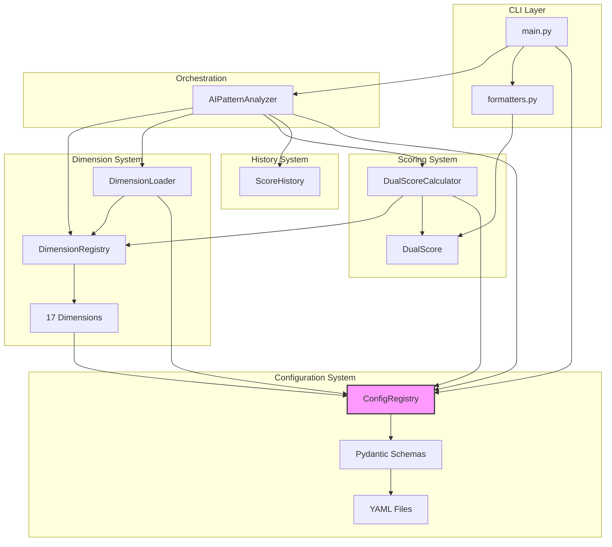

# 3. Component Architecture

## 3.1 High-Level Architecture

```
┌─────────────────────────────────────────────────────────────────┐
│                         CLI Layer                               │
│                    (cli/main.py, formatters.py)                 │
├─────────────────────────────────────────────────────────────────┤
│                      Orchestration Layer                        │
│                    (core/analyzer.py)                           │
├──────────────────┬──────────────────┬───────────────────────────┤
│   Dimension      │    Scoring       │      History              │
│   System         │    System        │      System               │
│  (dimensions/)   │   (scoring/)     │    (history/)             │
├──────────────────┴──────────────────┴───────────────────────────┤
│                     Core Infrastructure                         │
│        (registry, loader, config, results, exceptions)          │
├─────────────────────────────────────────────────────────────────┤
│                   Configuration System                          │
│         (ConfigRegistry, Pydantic Schemas, YAML files)          │
└─────────────────────────────────────────────────────────────────┘
```

## 3.2 Component Descriptions

### CLI Layer (`cli/`)

| Component | File | Responsibility |
|-----------|------|----------------|
| **CLI Entry Point** | `main.py` | Click commands, argument parsing |
| **Formatters** | `formatters.py` | Output formatting (text, JSON, TSV) |

### Orchestration Layer (`core/analyzer.py`)

**AIPatternAnalyzer** - Facade orchestrating all analysis:

```python
class AIPatternAnalyzer:
    def analyze_file(file_path, config) -> AnalysisResults
    def analyze_text(text, config) -> AnalysisResults
    def analyze_file_detailed(file_path) -> DetailedAnalysis
    def calculate_dual_score(results, targets) -> DualScore
    def load_score_history(file_path) -> ScoreHistory
    def save_score_history(history) -> None
```

### Dimension System (`dimensions/`)

| Component | Purpose |
|-----------|---------|
| **DimensionStrategy** | Abstract base class for all dimensions |
| **DimensionRegistry** | Thread-safe dimension registration |
| **DimensionLoader** | Config-driven lazy loading |
| **16 Dimensions** | Individual analysis implementations |

**DimensionStrategy Interface:**
```python
class DimensionStrategy(ABC):
    @property
    def dimension_name(self) -> str
    @property
    def weight(self) -> float
    @property
    def tier(self) -> DimensionTier  # ADVANCED, CORE, SUPPORTING, STRUCTURAL

    def analyze(text, lines, **kwargs) -> Dict[str, Any]
    def calculate_score(metrics) -> float  # 0-100, 100=most human-like
    def get_recommendations(score, metrics) -> List[str]
```

### Scoring System (`scoring/`)

| Component | Purpose |
|-----------|---------|
| **DualScore** | Score dataclasses, categories |
| **DualScoreCalculator** | Registry-based score calculation |
| **ScoreNormalization** | Z-score normalization |

### History System (`history/`)

| Component | Purpose |
|-----------|---------|
| **ScoreHistory** | Score tracking dataclass |
| **Trends** | Trend visualization, comparisons |

### Configuration System (`config/`)

| Component | Purpose |
|-----------|---------|
| **ConfigRegistry** | Thread-safe singleton for centralized configuration access |
| **Pydantic Schemas** | Type-safe configuration validation (`schemas/*.py`) |
| **YAML Files** | Declarative configuration (`base.yaml`, `{env}.yaml`) |

**ConfigRegistry Interface:**
```python
class ConfigRegistry:
    @classmethod
    def initialize(cls, env: str = "default", config_dir: Path = None) -> None:
        """Load configuration from YAML files."""
    @classmethod
    def get(cls, schema: Type[T]) -> T:
        """Get typed configuration section."""
    @classmethod
    def reset(cls) -> None:
        """Clear configuration (for testing)."""
    @classmethod
    def is_initialized(cls) -> bool:
        """Check initialization status."""
```

**Key Schemas:**
- `DimensionConfig` - Profiles, weights, parameters
- `ScoringConfig` - Thresholds, categories
- `ContentTypesConfig` - Content type weights and thresholds
- `AnalysisConfig` - Analysis modes, sampling

See [18. Configuration System](./18-configuration-system.md) for full details.

## 3.3 Component Interaction Diagram



## 3.4 Dimension Inventory

**16 dimensions** across 3 tiers, weights summing to 100%:

| Dimension | Tier | Weight | Purpose |
|-----------|------|--------|---------|
| `predictability` | ADVANCED | 18.1% | GLTR/n-gram analysis (transformers) |
| `advanced_lexical` | ADVANCED | 12.8% | MATTR, HDD, Yule's K diversity metrics |
| `transition_marker` | ADVANCED | 5.5% | Formulaic transition detection |
| `pragmatic_markers` | ADVANCED | 3.7% | Hedging, certainty, discourse markers |
| `perplexity` | ADVANCED | 2.8% | GPT-2 mathematical perplexity |
| `syntactic` | ADVANCED | 1.8% | Dependency tree complexity |
| `readability` | CORE | 9.2% | Flesch-Kincaid, Gunning Fog |
| `burstiness` | CORE | 5.5% | Sentence variation (GPTZero methodology) |
| `voice` | CORE | 4.6% | First-person, contractions, authenticity |
| `structure` | CORE | 3.7% | Heading hierarchy, lists |
| `formatting` | CORE | 3.7% | Em-dash patterns (strongest AI signal) |
| `ai_vocabulary` | CORE | 2.8% | AI-typical word patterns (34 terms) |
| `sentiment` | SUPPORTING | 15.6% | Emotional variance detection |
| `semantic_coherence` | SUPPORTING | 4.6% | Cross-sentence coherence (embeddings) |
| `figurative_language` | SUPPORTING | 2.8% | Similes, metaphors, idioms |
| `lexical` | SUPPORTING | 2.8% | Type-token ratio diversity |

**Tier Distribution:**
- **ADVANCED** (44.7%): ML-based, highest precision
- **CORE** (29.5%): Proven signatures >85% accuracy
- **SUPPORTING** (25.8%): Contextual quality indicators

## 3.5 Dimension Self-Registration Pattern

Each dimension follows this implementation pattern:

```python
class MyDimension(DimensionStrategy):
    def __init__(self):
        super().__init__()
        DimensionRegistry.register(self)  # Self-registration

    @property
    def dimension_name(self) -> str:
        return "my_dimension"

    @property
    def weight(self) -> float:
        return 5.0  # Percentage of total score

    @property
    def tier(self) -> str:
        return "CORE"  # ADVANCED, CORE, SUPPORTING, or STRUCTURAL

    def analyze(self, text, lines=None, config=None, **kwargs):
        # Use base class helper for mode-aware text preparation
        prepared = self._prepare_text(text, config, self.dimension_name)
        # Analyze and return metrics dict
        return {'metric': value, 'available': True, ...}

    def calculate_score(self, metrics):
        # Return 0-100 where 100 = most human-like
        score = ...
        self._validate_score(score)
        return score

    def get_recommendations(self, score, metrics):
        if score < 75:
            return ["Specific actionable suggestion"]
        return []

# Module-level singleton triggers self-registration on import
_instance = MyDimension()
```

---
